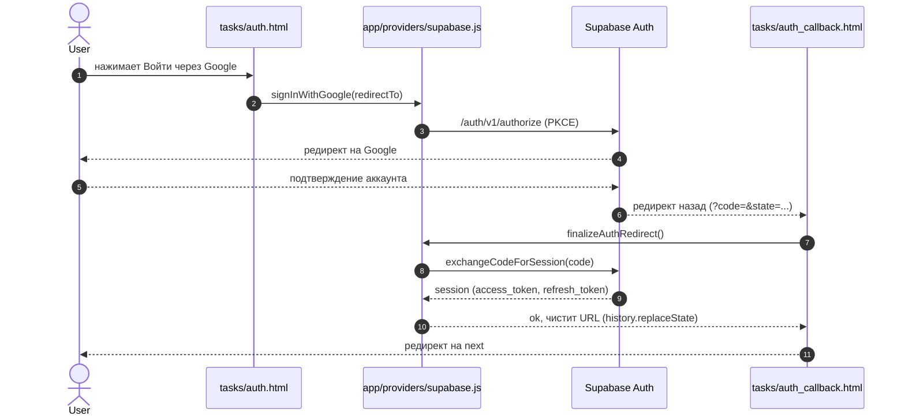
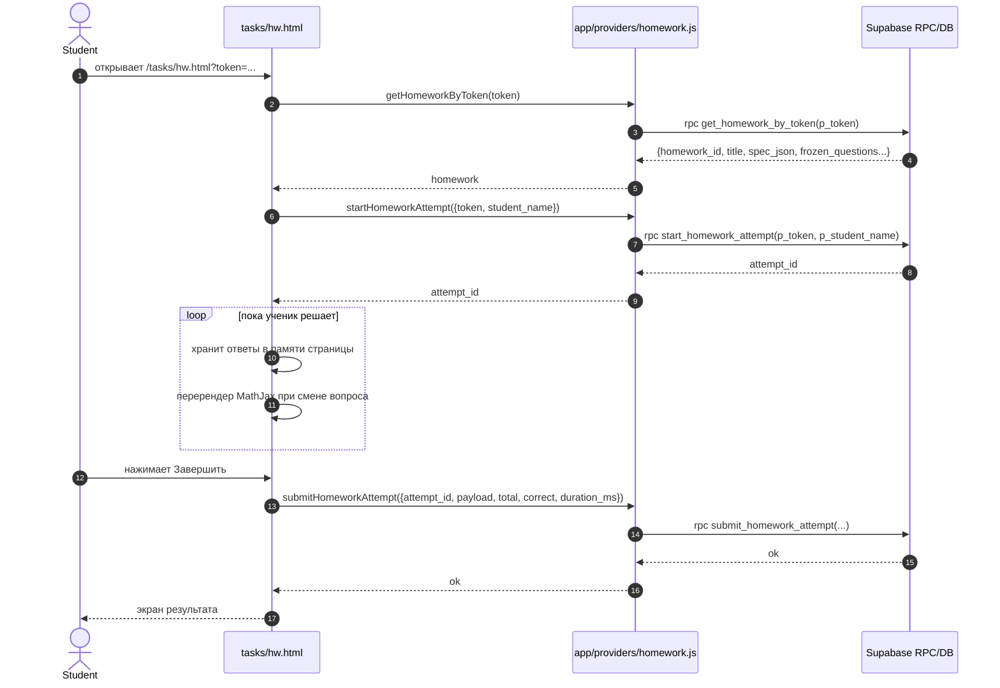
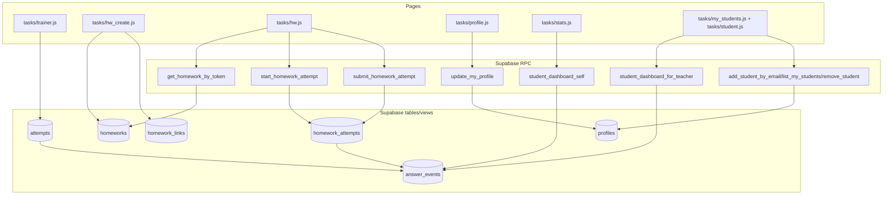

# Архитектура и потоки (L0)

Дата обновления: 2026-01-10

Коротко

- фронт: статический сайт без сборки, ES modules, несколько страниц в /tasks
- контент задач: JSON‑манифесты + изображения в /content
- бэкенд: Supabase (Auth + Postgres + PostgREST + RPC + RLS)
- математика: MathJax (рендер формул на страницах задач)

Компонентная схема (папки/модули)

```mermaid
flowchart LR
  subgraph Frontend[Frontend (static)]
    subgraph Pages[Pages]
      I[index.html]
      P[tasks/picker.js]
      T[tasks/trainer.js]
      L[tasks/list.js]
      HWc[tasks/hw_create.js]
      HW[tasks/hw.js]
      A[tasks/auth.js]
      Acb[tasks/auth_callback.js]
      Ar[tasks/auth_reset.js]
      Pr[tasks/profile.js]
      St[tasks/stats.js]
      Ms[tasks/my_students.js]
      Sd[tasks/student.js]
    end

    subgraph Shared[Shared modules]
      Cfg[app/config.js]
      Sb[app/providers/supabase.js]
      HwProv[app/providers/homework.js]
      PickCore[app/core/pick.js]
      Header[app/ui/header.js]
    end

    subgraph Content[Content]
      Cat[content/tasks/index.json]
      Manifests[content/tasks/.../*.json]
      Images[content/img/*]
    end

    I --> P
    P --> Cat
    T --> Manifests
    T --> PickCore

    HWc --> Cat
    HWc --> Manifests
    HWc --> HwProv

    HW --> HwProv

    A --> Sb
    Acb --> Sb
    Ar --> Sb
    Pr --> Sb

    I --> Header
    HWc --> Header
    T --> Header
    L --> Header

    Sb --> Cfg
    HwProv --> Sb
  end

  subgraph Supabase[Supabase]
    Auth[Auth (GoTrue)]
    DB[(Postgres + RLS)]
    RPC[RPC functions]
    Triggers[Triggers to answer_events]
  end

  Sb <--> Auth
  Sb <--> DB
  Sb <--> RPC
  DB --> Triggers
```

Жизненный цикл страницы (типовой)

1) HTML загружается

- на большинстве страниц подключается общий хедер через динамический import (пример: [index.html](../../index.html))

2) JS‑инициализация

- чтение meta app-build и формирование withV(...) для cache-busting
- регистрация DOM‑обработчиков
- подгрузка каталога контента (content/tasks/index.json) и манифестов тем

3) Auth‑инициализация (где надо)

- модуль [app/providers/supabase.js](../../app/providers/supabase.js) сам делает best-effort finalizeAuthRedirect() на большинстве страниц
- страницы [tasks/auth_callback.html](../../tasks/auth_callback.html) и [tasks/auth_reset.html](../../tasks/auth_reset.html) финализируют редирект явно

4) Работа пользователя

- выбор тем → тренировка/список
- создание ДЗ → выдача ссылки
- выполнение ДЗ → сохранение результата
- статистика → RPC дашборд

Доменные сущности (как думаем о данных)

- user: auth.users (uuid) + profiles (роль, имя)
- роль: student / teacher / admin (на уровне приложения)
- homework: домашнее задание (homeworks) + token‑ссылка (homework_links)
- homework_attempt: попытка прохождения домашки (homework_attempts)
- test attempt: попытка тренажёра (attempts) или события по задачам
- answer_event: унифицированное событие ответа (answer_events), источник для статистики

Последовательность: вход через Google (PKCE)



Последовательность: выполнение ДЗ до экрана результатов



Data-flow: какие таблицы трогаются где (укрупнённо)



Тонкие места и где расширять

1) OAuth/PKCE и очистка URL

- риск: двойная финализация редиректа (две вкладки, повторный import модуля с разным v)
- защита: guard ключи в sessionStorage (см. OAUTH_FINALIZE_KEY_PREFIX в [app/providers/supabase.js](../../app/providers/supabase.js))
- где чинить: [app/providers/supabase.js](../../app/providers/supabase.js), страницы callback/reset

2) Хранение сессии и ручной refresh

- страницы stats/my_students/student используют прямой PostgREST и сами обновляют access_token
- тонкость: формат хранения sb-<ref>-auth-token может отличаться (в коде есть pick(...) и fallback)
- где чинить: [tasks/stats.js](../../tasks/stats.js), [tasks/my_students.js](../../tasks/my_students.js)

3) События статистики

- статистика строится не по attempts напрямую, а по answer_events
- answer_events заполняется триггерами из attempts и homework_attempts
- точка расширения: добавление новых источников событий (source), новых полей агрегации

4) Контент задач

- важен формат question_id (строка) и topic_id (строка), они идут в статистику
- точка расширения: добавление новых тем в content/tasks/index.json и новых манифестов

5) RLS

- все права на чтение/запись должны быть на стороне Supabase, не на фронте
- новые фичи обычно требуют либо:
  - новые RPC (SECURITY DEFINER) для сложных проверок
  - новые политики RLS для простых таблиц

Ссылки

- Supabase контракт: [supabase.md](./supabase.md)
- Карта модулей: [modules/README.md](./modules/README.md)
