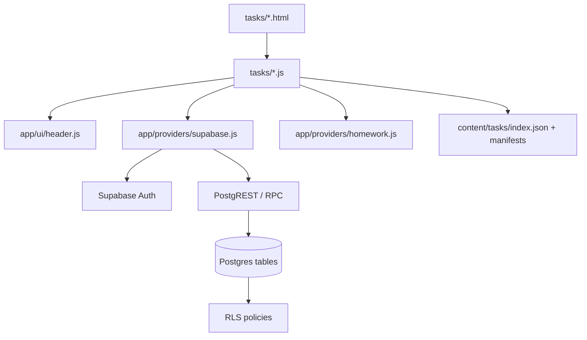
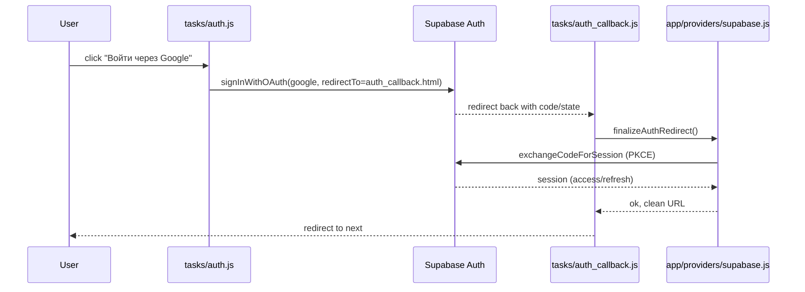
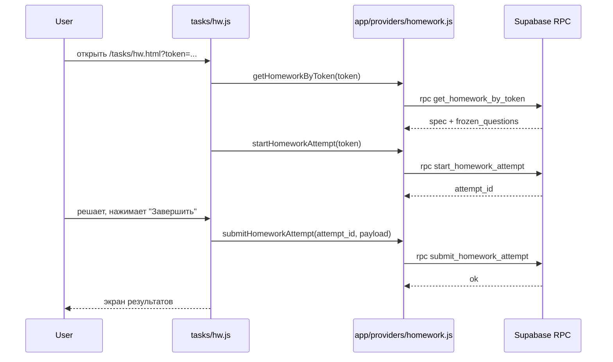
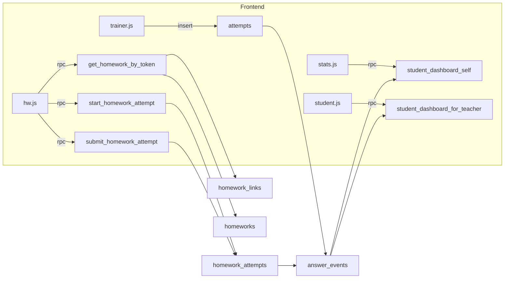

# Архитектура (L0)

Оглавление
- Контур системы
- Жизненный цикл страницы
- Доменные сущности
- Диаграммы
  - Компонентная схема
  - Вход через Google (sequence)
  - Выполнение ДЗ до результата (sequence)
  - Data-flow по таблицам/RPC

## Контур системы

Фронтенд: статические страницы в tasks/ и общие модули в app/.
Данные задач: content/ (JSON-манифесты + изображения).
Бэкенд: Supabase (Auth + Postgres + PostgREST RPC + RLS).

## Жизненный цикл страницы

Типичный цикл:
1) загрузка html
2) подключение модулей (type="module")
3) initHeader (если на странице используется шапка)
4) загрузка данных (content JSON, затем Supabase)
5) рендер DOM
6) обработчики событий
7) MathJax typeset после вставки формул

Где это реализовано:
- шапка: ../../../app/ui/header.js
- Supabase клиент и finalize redirect: ../../../app/providers/supabase.js
- тренажёр: ../../../tasks/trainer.js
- ДЗ: ../../../tasks/hw.js
- статистика: ../../../tasks/stats.js (через REST rpc)

## Доменные сущности

- пользователь и роль: profiles (ученик/учитель), teachers (whitelist), teacher_students (связь)
- задание (ДЗ): homeworks
- ссылка на ДЗ: homework_links (token)
- попытка ДЗ: homework_attempts
- попытка решения задачи вне ДЗ: attempts
- событие ответа: answer_events (обычно наполняется сервером и используется для статистики)

## Диаграммы

### Компонентная схема

### Вход через Google (sequence)

Подробный сценарий: scenarios/login_google.md

### Выполнение ДЗ до результата (sequence)

Подробные сценарии:
- scenarios/homework_start.md
- scenarios/homework_submit.md

### Data-flow по таблицам/RPC

