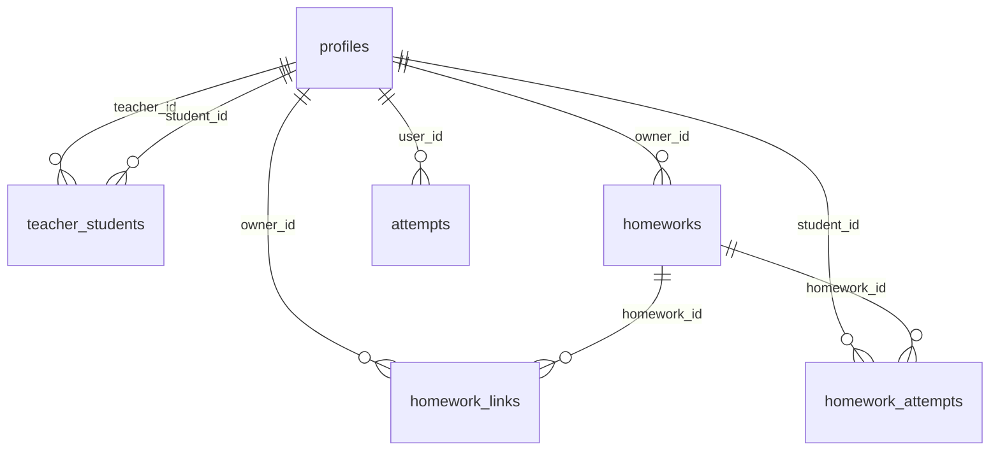

# Supabase: контракт и данные

Оглавление
- Общая модель доступа
- Таблицы и смысл
- Связи (ER диаграмма)
- RPC функции и кто вызывает
- Auth и хранение сессии на фронте
- Типовые ошибки (PKCE, redirect, RLS)
- Матрица: экран → таблицы/RPC

Источник схемы: supabase_schema_overview.md (в корне репозитория).

## Общая модель доступа

- Гость: может открыть контент и UI, но не может писать результаты/начинать ДЗ.
- Ученик: решает тренажёр и ДЗ, видит свою статистику.
- Учитель: создаёт ДЗ, управляет связью с учениками, видит статистику учеников.

RLS включён на ключевых таблицах (homeworks, homework_links, homework_attempts, attempts, answer_events, profiles, teachers, teacher_students). Критичные операции сделаны через RPC, чтобы не давать фронту “сырые” права.

## Таблицы и смысл

- profiles: профиль пользователя (роль, имя, признаки завершённости профиля)
- teachers: whitelist учителей (и/или служебные флаги)
- teacher_students: связь учитель–ученик
- homeworks: задание, созданное учителем (спека, параметры)
- homework_links: токенизированная ссылка на ДЗ
- homework_attempts: попытки выполнения ДЗ
- attempts: попытки решения задач вне ДЗ (тренажёр)
- answer_events: лента событий ответа для статистики (может наполняться триггерами)

## Связи (ER диаграмма)

## RPC функции и кто вызывает

- update_my_profile
  - вызывает: ../../../tasks/google_complete.js, ../../../tasks/profile.js

- delete_my_account
  - вызывает: ../../../tasks/profile.js

- get_homework_by_token
  - вызывает: ../../../app/providers/homework.js (используется в ../../../tasks/hw.js)

- start_homework_attempt, has_homework_attempt, submit_homework_attempt
  - вызывает: ../../../app/providers/homework.js (используется в ../../../tasks/hw.js)

- student_dashboard_self
  - вызывает: ../../../tasks/stats.js

- teacher_students_summary, list_my_students, add_student_by_email, remove_student
  - вызывает: ../../../tasks/my_students.js

- student_dashboard_for_teacher (и родственные)
  - вызывает: ../../../tasks/student.js

Полные сигнатуры и параметры смотреть в supabase_schema_overview.md.

## Auth и хранение сессии на фронте

Используется supabase-js v2 с PKCE.
Сессия хранится в localStorage ключами вида sb-<project-ref>-auth-token (формат Supabase).

Где чинить:
- OAuth/PKCE: ../../../app/providers/supabase.js (finalizeAuthRedirect, signInWithGoogle)
- страницы: ../../../tasks/auth.js, ../../../tasks/auth_callback.js, ../../../tasks/auth_reset.js

## Типовые ошибки и где искать

- PKCE “code verifier” / повторная обработка redirect
  - симптомы: вход “иногда работает”, потом выкидывает, ошибки exchangeCodeForSession
  - чинить: finalizeAuthRedirect должен вызываться один раз на странице callback и как можно раньше

- redirectTo и next
  - симптомы: после входа попадаем не туда
  - чинить: tasks/auth.js и tasks/auth_callback.js

- RLS 401/403 на RPC
  - смотреть Network: /rest/v1/rpc/...
  - проверять: включён ли Authorization: Bearer <access_token>
  - сверять политики по таблицам из supabase_schema_overview.md

## Матрица: экран → таблицы/RPC

- Главный тренажёр (tasks/trainer.js)
  - insert: attempts
  - косвенно влияет на статистику через answer_events

- Создание ДЗ (tasks/hw_create.js)
  - insert: homeworks, homework_links

- Выполнение ДЗ (tasks/hw.js)
  - rpc: get_homework_by_token, start_homework_attempt, submit_homework_attempt
  - writes: homework_attempts (через RPC)

- Статистика ученика (tasks/stats.js)
  - rpc: student_dashboard_self
  - читает агрегаты из answer_events (на стороне БД)

- Кабинет учителя (tasks/my_students.js, tasks/student.js)
  - rpc: list_my_students, teacher_students_summary, add_student_by_email, remove_student
  - rpc: student_dashboard_for_teacher
