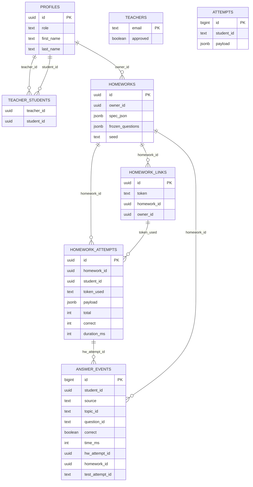

# Supabase: контракт и данные

Дата обновления: 2026-01-10

Источники

- схема и список функций/триггеров: [supabase_schema_overview.md](../../supabase_schema_overview.md)
- настройки подключения (url, anonKey): [app/config.js](../../app/config.js)

Контур

- Supabase URL: https://knhozdhvjhcovyjbjfji.supabase.co
- project ref: knhozdhvjhcovyjbjfji
- основной клиент: [app/providers/supabase.js](../../app/providers/supabase.js)

ER‑связи (уровень домена)

Auth

Провайдеры

- Google OAuth (PKCE)
- email/password (signup/signin)
- reset/recovery через email

Где хранится сессия на фронте

- supabase-js сохраняет сессию в localStorage под ключом формата sb-<ref>-auth-token
- в этом проекте ref берётся из CONFIG.supabase.url, поэтому ключ обычно:
  - sb-knhozdhvjhcovyjbjfji-auth-token

Типовые ошибки и где чинить

- code verifier / PKCE гонки
  - чаще всего от двойной финализации редиректа или разных версий модулей (?v=...)
  - чинить в [app/providers/supabase.js](../../app/providers/supabase.js) (finalizeAuthRedirect + guards)
  - проверять страницы [tasks/auth_callback.js](../../tasks/auth_callback.js), [tasks/auth_reset.js](../../tasks/auth_reset.js)

- токены не обновляются на страницах статистики
  - страницы stats/my_students/student делают refresh вручную
  - чинить в [tasks/stats.js](../../tasks/stats.js), [tasks/my_students.js](../../tasks/my_students.js)

Таблицы (public)

Короткие смыслы и кто их использует.

- profiles
  - 1:1 с auth.users
  - роль и отображаемые данные
  - читают/пишут: header.js, profile.js, google_complete.js

- teachers
  - белый список учителей (email, approved)
  - используется проверками is_allowed_teacher / is_teacher_email

- teacher_students
  - связь учитель ↔ ученик
  - пишется/читается через RPC кабинета учителя

- homeworks
  - домашнее задание учителя (owner_id)
  - создаётся на странице hw_create

- homework_links
  - ссылки‑токены на домашку (token)
  - создаются на hw_create

- homework_attempts
  - попытка выполнения домашки
  - создаётся/обновляется через RPC start_homework_attempt / submit_homework_attempt

- attempts
  - попытки тренажёра
  - пишутся с [tasks/trainer.js](../../tasks/trainer.js)
  - важная особенность: student_id хранится как text (см. риски в supabase_schema_overview)

- answer_events
  - единая лента событий ответов (источник статистики)
  - заполняется триггерами из attempts и homework_attempts

Витрины/представления

- attempts_flat, attempts_daily, questions_flat
  - витрины для аналитики (статистика/отчёты)
  - на фронте напрямую не используются, но могут быть полезны для новых отчётов

RPC функции (публичный контракт)

Ниже перечислены функции, на которые опирается фронт. Полный список см. в [supabase_schema_overview.md](../../supabase_schema_overview.md).

Профиль

- update_my_profile(...)
  - кто вызывает: [tasks/profile.js](../../tasks/profile.js), [tasks/google_complete.js](../../tasks/google_complete.js)

- delete_my_account()
  - кто вызывает: [tasks/profile.js](../../tasks/profile.js)

Кабинет учителя (ученики)

- add_student_by_email(p_email)
  - кто вызывает: [tasks/my_students.js](../../tasks/my_students.js)

- list_my_students()
  - кто вызывает: [tasks/my_students.js](../../tasks/my_students.js)

- remove_student(p_student_id)
  - кто вызывает: [tasks/my_students.js](../../tasks/my_students.js)

Домашки

- get_homework_by_token(p_token)
  - кто вызывает: [app/providers/homework.js](../../app/providers/homework.js) → [tasks/hw.js](../../tasks/hw.js)

- start_homework_attempt(p_token, p_student_name)
  - кто вызывает: [app/providers/homework.js](../../app/providers/homework.js) → [tasks/hw.js](../../tasks/hw.js)

- has_homework_attempt(p_token, p_student_name)
  - кто вызывает: (опционально) hw.js, провайдер homeworks

- submit_homework_attempt(p_attempt_id, p_payload, p_total, p_correct, p_duration_ms)
  - кто вызывает: [app/providers/homework.js](../../app/providers/homework.js) → [tasks/hw.js](../../tasks/hw.js)

- get_homework_attempt_by_token(p_token)
  - кто вызывает: [app/providers/homework.js](../../app/providers/homework.js) (экран результата при повторном входе)

- get_homework_attempt_for_teacher(...)
  - кто вызывает: (в текущем фронте может быть не подключено)

Статистика

- student_dashboard_self(p_days, p_source)
  - кто вызывает: [tasks/stats.js](../../tasks/stats.js)

- student_dashboard_for_teacher(p_student_id, p_days, p_source)
  - кто вызывает: [tasks/student.js](../../tasks/student.js)

- teacher_students_summary(p_days, p_source)
  - кто вызывает: [tasks/my_students.js](../../tasks/my_students.js)

- list_student_attempts(...)
  - кто вызывает: (частично student.js, зависит от UI)

RLS и роли (модель доступа)

Роли приложения

- гость: не залогинен
- student: залогинен, роль в profiles.role = student
- teacher: залогинен, роль = teacher, обычно ещё email должен быть в teachers.approved

Правила владения

- owner_id = auth.uid() для сущностей учителя
  - homeworks, homework_links

- student_id = auth.uid() для сущностей ученика
  - homework_attempts, answer_events

Доступ учителя к данным ученика

- через teacher_students и проверки вида is_teacher_for_student(student_id)

Триггеры и события

- attempts → trg_attempts_to_answer_events()
  - при вставке попытки тренажёра создаются строки answer_events (source='test')

- homework_attempts → trg_homework_attempts_to_answer_events()
  - при первой установке payload создаются строки answer_events (source='hw')

Матрица экран → таблицы/RPC (минимальный срез)

| экран | файлы | таблицы | RPC | операции |
| --- | --- | --- | --- | --- |
| выбор тем | [index.html](../../index.html), [tasks/picker.js](../../tasks/picker.js) | (нет) | (нет) | fetch контента |
| тренажёр | [tasks/trainer.js](../../tasks/trainer.js) | attempts | (нет) | insert attempts |
| создание ДЗ | [tasks/hw_create.js](../../tasks/hw_create.js), [app/providers/homework.js](../../app/providers/homework.js) | homeworks, homework_links | (нет) | insert |
| выполнение ДЗ | [tasks/hw.js](../../tasks/hw.js), [app/providers/homework.js](../../app/providers/homework.js) | homework_attempts, answer_events | get_homework_by_token, start_homework_attempt, submit_homework_attempt | rpc + триггеры |
| профиль | [tasks/profile.js](../../tasks/profile.js) | profiles | update_my_profile, delete_my_account | rpc |
| статистика (ученик) | [tasks/stats.js](../../tasks/stats.js) | answer_events | student_dashboard_self | rpc |
| ученики (учитель) | [tasks/my_students.js](../../tasks/my_students.js) | teacher_students, profiles | add_student_by_email, list_my_students, remove_student, teacher_students_summary | rpc |
| статистика ученика (учитель) | [tasks/student.js](../../tasks/student.js) | answer_events | student_dashboard_for_teacher | rpc |

Отладка и логи

- DevTools → Network
  - supabase-js: запросы к /auth/v1/* и /rest/v1/*
  - прямой REST (stats/my_students): /rest/v1/rpc/<fn>

- DevTools → Application → Local Storage
  - sb-knhozdhvjhcovyjbjfji-auth-token
  - другие ключи, влияющие на UX:
    - auth_force_google_select_account

- серверная отладка
  - смотреть логи функций RPC в Supabase (Database → Logs)
  - проверять политики RLS на таблицах
